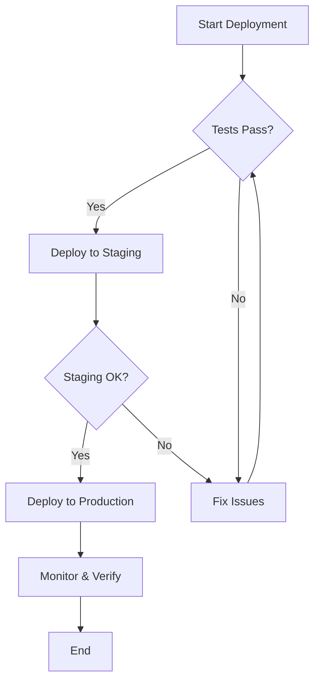
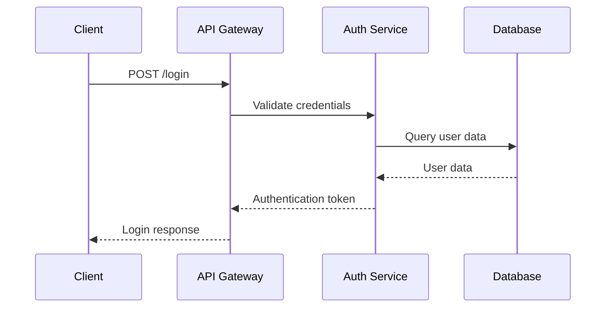
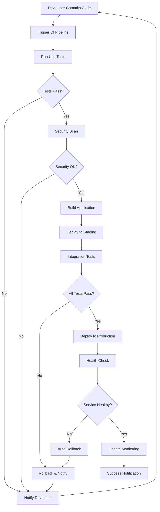
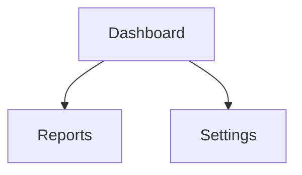
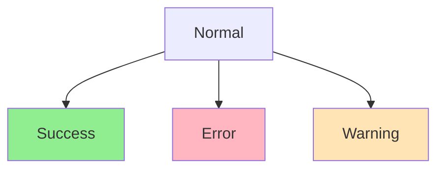
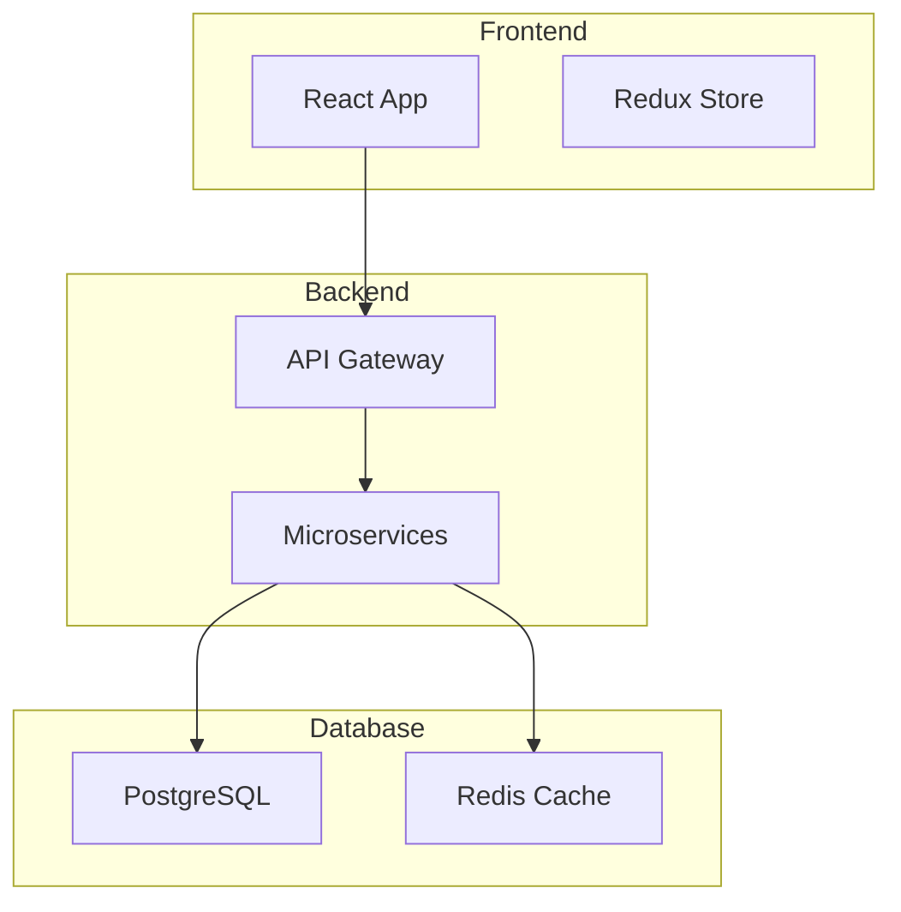

````markdown
# Mermaid MCP Server User Guide

> **Complete guide to using the Mermaid MCP Server with GitHub Copilot, Claude, and other AI assistants**

[](https://nodejs.org/)
[](https://modelcontextprotocol.io/)
[](https://mermaid.js.org/)

## Overview

The **Mermaid MCP (Model Context Protocol) Server** enables AI assistants like GitHub Copilot, Claude, and custom LLM applications to generate, validate, and render professional Mermaid diagrams directly within your development workflow. This guide covers all functionality, integration methods, and usage patterns.

## 📋 Table of Contents

### Getting Started
1. [Quick Start](#quick-start)
2. [Integration Methods](#-integration-methods)
3. [Using in Other Projects](#-using-mcp-in-other-projects)

### Core Features
4. [Available Tools](#available-tools)
5. [Diagram Types](#diagram-types)
6. [Usage Examples](#usage-examples)

### Advanced Topics
7. [Advanced Features](#advanced-features)
8. [Integration Patterns](#integration-patterns)
9. [Best Practices](#best-practices)
10. [Customization](#customization-options)
11. [Troubleshooting](#troubleshooting)

---

## Quick Start

### ⚡ 3-Step Quick Start

#### 1️⃣ Verify MCP Server is Running

```bash
# Check if server is configured (should return tool list)
echo '{"jsonrpc":"2.0","id":1,"method":"tools/list"}' | node ~/Documents/Mermaid/mermaid-mcp-server/dist/index.js
```

#### 2️⃣ Use with GitHub Copilot Chat

Open Copilot Chat (`Cmd+Shift+I`) and type:

```
Create a flowchart showing user authentication with OAuth
```

#### 3️⃣ Get Professional Diagrams

Copilot will call the MCP server and return:
- ✅ Mermaid diagram code
- ✅ Production-ready SVG file
- ✅ Markdown-ready format

---

## 🔌 Integration Methods

The Mermaid MCP Server supports multiple integration methods for different use cases:

### Method 1: GitHub Copilot in VS Code (Most Common)

**Best for:** Daily development workflow, documentation writing, code reviews

**Setup:**
```json
// Add to VS Code settings.json (Cmd+Shift+P -> "Preferences: Open User Settings (JSON)")
{
  "github.copilot.mcp.servers": {
    "mermaid": {
      "command": "node",
      "args": ["/absolute/path/to/mermaid-mcp-server/dist/index.js"]
    }
  }
}
```

**Usage:**
```markdown
<!-- In any markdown or code file -->

<!-- Create a microservices architecture diagram -->

<!-- Generate a sequence diagram for user login -->
```

**Copilot will automatically:**
- Detect your request
- Call the MCP server
- Generate the diagram
- Return ready-to-use code

---

### Method 2: Claude Desktop App

**Best for:** Standalone diagram generation, brainstorming, documentation outside IDE

**Setup:**
```json
// Edit: ~/Library/Application Support/Claude/claude_desktop_config.json
{
  "mcpServers": {
    "mermaid": {
      "command": "node",
      "args": ["/Users/YOUR_USERNAME/Documents/Mermaid/mermaid-mcp-server/dist/index.js"]
    }
  }
}
```

**Usage in Claude:**
```
User: Create a flowchart showing the CI/CD pipeline

Claude: I'll use the Mermaid MCP server to generate that...
[Calls MCP tool: create_diagram]
[Returns professional diagram]
```

---

### Method 3: Cursor IDE

**Best for:** AI-first development environment with built-in MCP support

**Setup:**
```json
// Add to Cursor settings (Settings -> MCP Servers)
{
  "mcpServers": {
    "mermaid": {
      "command": "node",
      "args": ["/absolute/path/to/mermaid-mcp-server/dist/index.js"]
    }
  }
}
```

**Usage:** Same as Copilot - natural language requests in chat or comments

---

### Method 4: Direct CLI Usage

**Best for:** Automation, scripts, CI/CD pipelines, batch generation

**Generate SVG Files:**
```bash
cd ~/Documents/Mermaid/mermaid-mcp-server

# Generate sample architecture diagrams
node generate-svg-samples.js

# Output: 5 production-ready SVG files in examples/architectures/
```

**Custom Generation Script:**
```javascript
// custom-diagram-generator.js
import puppeteer from 'puppeteer';
import fs from 'fs/promises';

async function generateDiagram(mermaidCode, outputPath) {
  const browser = await puppeteer.launch({ headless: 'new' });
  const page = await browser.newPage();
  
  const html = `
    <!DOCTYPE html>
    <html>
      <head>
        <script type="module">
          import mermaid from 'https://cdn.jsdelivr.net/npm/mermaid@10/dist/mermaid.esm.min.mjs';
          mermaid.initialize({ startOnLoad: true, theme: 'default' });
        </script>
      </head>
      <body>
        <div class="mermaid">${mermaidCode}</div>
      </body>
    </html>
  `;
  
  await page.setContent(html);
  await page.waitForTimeout(3000);
  
  const svg = await page.evaluate(() => {
    return document.querySelector('.mermaid svg').outerHTML;
  });
  
  await fs.writeFile(outputPath, svg.replace(/<br>/g, '<br/>').trim());
  await browser.close();
}

// Usage
await generateDiagram('graph TD\n  A[Start] --> B[End]', 'output.svg');
```

---

### Method 5: MCP Inspector (Testing & Debugging)

**Best for:** Testing tools, debugging, development

**Install:**
```bash
npm install -g @modelcontextprotocol/inspector
```

**Run:**
```bash
# Start inspector with your MCP server
mcp-inspector node ~/Documents/Mermaid/mermaid-mcp-server/dist/index.js
```

**Use:**
- Opens web interface at http://localhost:5173
- Test all MCP tools interactively
- View request/response JSON
- Debug server behavior

---

### Method 6: Custom LLM Applications

**Best for:** Building your own AI apps with diagram generation

**Example: Node.js Integration**
```typescript
import { Client } from '@modelcontextprotocol/sdk/client/index.js';
import { StdioClientTransport } from '@modelcontextprotocol/sdk/client/stdio.js';

// Create MCP client
const transport = new StdioClientTransport({
  command: 'node',
  args: ['/path/to/mermaid-mcp-server/dist/index.js']
});

const client = new Client({
  name: 'my-app',
  version: '1.0.0'
}, {
  capabilities: {}
});

await client.connect(transport);

// List available tools
const tools = await client.listTools();
console.log('Available tools:', tools);

// Generate diagram
const result = await client.callTool({
  name: 'create_diagram',
  arguments: {
    type: 'flowchart',
    description: 'User authentication process'
  }
});

console.log('Generated diagram:', result);
```

**Example: Python Integration**
```python
import subprocess
import json

def call_mermaid_mcp(tool_name, arguments):
    """Call Mermaid MCP server from Python"""
    request = {
        "jsonrpc": "2.0",
        "id": 1,
        "method": "tools/call",
        "params": {
            "name": tool_name,
            "arguments": arguments
        }
    }
    
    process = subprocess.Popen(
        ['node', '/path/to/mermaid-mcp-server/dist/index.js'],
        stdin=subprocess.PIPE,
        stdout=subprocess.PIPE,
        stderr=subprocess.PIPE
    )
    
    stdout, stderr = process.communicate(
        input=json.dumps(request).encode()
    )
    
    return json.loads(stdout.decode())

# Usage
result = call_mermaid_mcp('create_diagram', {
    'type': 'sequence',
    'description': 'API request flow'
})

print(result)
```

---

## 🚀 Using MCP in Other Projects

### Scenario 1: Adding to Existing VS Code Project

**Goal:** Enable Copilot to generate diagrams in your current project

**Steps:**

1. **Verify MCP Server Setup** (one-time)
   ```bash
   cd ~/Documents/Mermaid/mermaid-mcp-server
   npm run build
   ```

2. **Add to VS Code Workspace Settings**
   ```json
   // .vscode/settings.json in your project
   {
     "github.copilot.mcp.servers": {
       "mermaid": {
         "command": "node",
         "args": ["${env:HOME}/Documents/Mermaid/mermaid-mcp-server/dist/index.js"]
       }
     }
   }
   ```

3. **Use in Your Project**
   ```markdown
   # docs/architecture.md
   
   ## System Overview
   
   <!-- Create a high-level architecture diagram for our microservices -->
   ```

**Benefits:**
- ✅ Team members inherit the configuration
- ✅ Diagrams stay consistent
- ✅ Documentation updates are AI-assisted

---

### Scenario 2: Documentation Repository

**Goal:** Automated diagram generation in a docs repo

**Project Structure:**
```
docs-repo/
├── .vscode/
│   └── settings.json          # MCP configuration
├── diagrams/
│   ├── generate.js            # Custom generator script
│   └── templates/             # Diagram templates
├── architecture/
│   └── system-design.md       # Auto-generated diagrams
└── package.json               # Scripts for automation
```

**Setup:**

1. **Add npm script**
   ```json
   {
     "scripts": {
       "diagrams:generate": "node diagrams/generate.js",
       "diagrams:watch": "nodemon diagrams/generate.js"
     },
     "devDependencies": {
       "nodemon": "^3.0.0"
     }
   }
   ```

2. **Create generator script**
   ```javascript
   // diagrams/generate.js
   import { execSync } from 'child_process';
   import fs from 'fs';
   
   const diagrams = [
     {
       name: 'auth-flow',
       description: 'User authentication with OAuth',
       output: 'architecture/auth-flow.svg'
     },
     {
       name: 'data-pipeline',
       description: 'ETL data processing pipeline',
       output: 'architecture/data-pipeline.svg'
     }
   ];
   
   for (const diagram of diagrams) {
     console.log(`Generating ${diagram.name}...`);
     // Generate using MCP or direct Puppeteer
   }
   ```

3. **Use in GitHub Actions**
   ```yaml
   # .github/workflows/update-diagrams.yml
   name: Update Diagrams
   
   on:
     push:
       paths:
         - 'diagrams/**'
   
   jobs:
     generate:
       runs-on: ubuntu-latest
       steps:
         - uses: actions/checkout@v3
         
         - name: Setup Node.js
           uses: actions/setup-node@v3
           with:
             node-version: '18'
         
         - name: Install dependencies
           run: |
             cd ~/Documents/Mermaid/mermaid-mcp-server
             npm install
         
         - name: Generate diagrams
           run: npm run diagrams:generate
         
         - name: Commit updated diagrams
           run: |
             git config user.name "GitHub Actions"
             git config user.email "actions@github.com"
             git add architecture/*.svg
             git commit -m "📊 Update architecture diagrams"
             git push
   ```

---

### Scenario 3: Web Application Integration

**Goal:** Generate diagrams on-demand in a web app

**Architecture:**
```
web-app/
├── frontend/              # React/Vue/Angular
│   └── components/
│       └── DiagramViewer.tsx
├── backend/
│   └── api/
│       └── diagrams.ts   # MCP client integration
└── mcp-client/           # Wrapper around MCP server
    └── index.ts
```

**Backend API (Express + MCP):**
```typescript
// backend/api/diagrams.ts
import express from 'express';
import { Client } from '@modelcontextprotocol/sdk/client/index.js';

const router = express.Router();

// Initialize MCP client (reuse connection)
let mcpClient: Client | null = null;

async function getMCPClient() {
  if (!mcpClient) {
    const transport = new StdioClientTransport({
      command: 'node',
      args: [process.env.MCP_SERVER_PATH]
    });
    
    mcpClient = new Client({ name: 'web-app', version: '1.0.0' }, {});
    await mcpClient.connect(transport);
  }
  return mcpClient;
}

// API endpoint
router.post('/generate', async (req, res) => {
  try {
    const { type, description } = req.body;
    const client = await getMCPClient();
    
    const result = await client.callTool({
      name: 'create_diagram',
      arguments: { type, description }
    });
    
    res.json(result);
  } catch (error) {
    res.status(500).json({ error: error.message });
  }
});

export default router;
```

**Frontend Component (React):**
```typescript
// frontend/components/DiagramViewer.tsx
import React, { useState } from 'react';

export function DiagramGenerator() {
  const [description, setDescription] = useState('');
  const [diagram, setDiagram] = useState('');
  const [loading, setLoading] = useState(false);
  
  const generateDiagram = async () => {
    setLoading(true);
    try {
      const response = await fetch('/api/diagrams/generate', {
        method: 'POST',
        headers: { 'Content-Type': 'application/json' },
        body: JSON.stringify({
          type: 'flowchart',
          description
        })
      });
      
      const result = await response.json();
      setDiagram(result.content);
    } catch (error) {
      console.error('Failed to generate diagram:', error);
    }
    setLoading(false);
  };
  
  return (
    <div>
      <textarea
        value={description}
        onChange={(e) => setDescription(e.target.value)}
        placeholder="Describe your diagram..."
      />
      <button onClick={generateDiagram} disabled={loading}>
        {loading ? 'Generating...' : 'Generate Diagram'}
      </button>
      {diagram && (
        <div dangerouslySetInnerHTML={{ __html: diagram }} />
      )}
    </div>
  );
}
```

---

### Scenario 4: Monorepo with Multiple Projects

**Goal:** Share MCP server across multiple projects in a monorepo

**Structure:**
```
monorepo/
├── packages/
│   ├── web-app/
│   ├── mobile-app/
│   ├── api-server/
│   └── shared-docs/
├── tools/
│   └── mermaid-mcp-server/    # Shared MCP server
└── .vscode/
    └── settings.json           # Workspace-wide config
```

**Workspace Settings:**
```json
// .vscode/settings.json
{
  "github.copilot.mcp.servers": {
    "mermaid": {
      "command": "node",
      "args": ["${workspaceFolder}/tools/mermaid-mcp-server/dist/index.js"]
    }
  },
  "folders": [
    { "path": "packages/web-app" },
    { "path": "packages/mobile-app" },
    { "path": "packages/api-server" },
    { "path": "packages/shared-docs" }
  ]
}
```

**Benefits:**
- ✅ One MCP server for entire monorepo
- ✅ Consistent diagram generation across all packages
- ✅ Centralized maintenance

---

### Scenario 5: NPM Package Distribution

**Goal:** Publish MCP server as reusable npm package

**Package Structure:**
```json
{
  "name": "@your-org/mermaid-mcp-server",
  "version": "1.0.0",
  "type": "module",
  "bin": {
    "mermaid-mcp": "./dist/index.js"
  },
  "files": ["dist"],
  "scripts": {
    "build": "tsc",
    "prepublishOnly": "npm run build"
  }
}
```

**Installation in Other Projects:**
```bash
# Install globally
npm install -g @your-org/mermaid-mcp-server

# Or per-project
npm install --save-dev @your-org/mermaid-mcp-server
```

**Configuration:**
```json
{
  "github.copilot.mcp.servers": {
    "mermaid": {
      "command": "mermaid-mcp",  // Uses global bin
      "args": []
    }
  }
}
```

---

## Available Tools

### Core Diagram Generation Tools (Enhanced)

#### 1. `generate_advanced_flowchart`
**Purpose**: Create flowcharts with advanced layout engines and styling

**Parameters**:
- `description` (required): Natural language description of the process
- `direction` (optional): Flow direction - `TD`, `LR`, `BT`, `RL`
- `layoutEngine` (optional): Layout algorithm - `dagre`, `elk`, `tidyTree`
- `styling` (optional): Advanced styling options
- `interactivity` (optional): Interactive features configuration

**Example**:
```json
{
  "description": "User authentication process with OAuth",
  "direction": "TD",
  "layoutEngine": "elk",
  "styling": {
    "theme": "dark",
    "nodeSpacing": 50,
    "curve": "cardinal"
  },
  "interactivity": {
    "clickableNodes": true,
    "animations": true
  }
}
```

#### 1b. `generate_flowchart` (Basic)
**Purpose**: Create simple flowcharts from natural language descriptions

**Parameters**:
- `description` (required): Natural language description of the process
- `direction` (optional): Flow direction - `TD` (Top-Down), `LR` (Left-Right), `BT` (Bottom-Top), `RL` (Right-Left)

**Example**:
```json
{
  "description": "User authentication process with OAuth",
  "direction": "TD"
}
```

#### 2. `generate_sequence_diagram`
**Purpose**: Create sequence diagrams for interactions between entities

**Parameters**:
- `description` (required): Description of the interactions
- `participants` (optional): Array of participant names

**Example**:
```json
{
  "description": "API request flow between client, server, and database",
  "participants": ["Client", "API Server", "Database", "Cache"]
}
```

#### 3. `generate_class_diagram`
**Purpose**: Create UML class diagrams

**Parameters**:
- `description` (required): Description of classes and relationships
- `namespace` (optional): Group classes in namespaces

**Example**:
```json
{
  "description": "E-commerce system with User, Product, and Order classes"
}
```

#### 4. `generate_state_diagram`
**Purpose**: Create state transition diagrams

**Parameters**:
- `description` (required): Description of states and transitions
- `initialState` (optional): Starting state name

#### 5. `generate_er_diagram`
**Purpose**: Create Entity-Relationship diagrams

**Parameters**:
- `description` (required): Description of entities and relationships
- `entities` (optional): Array of entity names

#### 6. `generate_gantt_chart`
**Purpose**: Create project timeline charts

**Parameters**:
- `description` (required): Project description
- `tasks` (optional): Array of task objects
- `dateFormat` (optional): Date format (default: YYYY-MM-DD)

#### 7. `generate_mindmap`
**Purpose**: Create mind maps

**Parameters**:
- `description` (required): Topic and subtopics description
- `centralTopic` (optional): Main topic name

#### 8. `generate_architecture_diagram`
**Purpose**: Create system architecture diagrams

**Parameters**:
- `description` (required): Architecture description
- `architectureType` (optional): Type - `microservices`, `layered`, `event-driven`, `serverless`
- `components` (optional): Component definitions
- `relationships` (optional): Component relationships

#### 9. `generate_data_visualization`
**Purpose**: Create data visualization diagrams

**Parameters**:
- `description` (required): Data visualization description
- `type` (required): Chart type - `pie`, `xychart`, `radar`, `sankey`, `treemap`, `quadrant`
- `data` (optional): Data source configuration

#### 10. `generate_block_diagram`
**Purpose**: Create block diagrams for system components

**Parameters**:
- `description` (required): Block diagram description
- `layout` (optional): Layout configuration

#### 11. `generate_packet_diagram`
**Purpose**: Create network packet diagrams

**Parameters**:
- `description` (required): Packet structure description
- `protocol` (optional): Network protocol type

#### 12. `generate_kanban_board`
**Purpose**: Create Kanban workflow diagrams

**Parameters**:
- `description` (required): Workflow description
- `columns` (optional): Board column definitions
- `tasks` (optional): Task definitions

### Enhanced Utility Tools

#### 13. `render_with_layouts`
**Purpose**: Render diagrams with advanced layout engines

**Parameters**:
- `mermaidCode` (required): Valid Mermaid diagram code
- `layoutEngine` (optional): Layout engine - `elk`, `tidyTree`, `dagre`
- `layoutOptions` (optional): Engine-specific options
- `theme` (optional): Visual theme configuration
- `outputFormats` (optional): Output formats - `svg`, `png`, `pdf`

#### 14. `generate_interactive_diagram`
**Purpose**: Create interactive diagrams with animations and user interactions

**Parameters**:
- `mermaidCode` (required): Base Mermaid code
- `interactions` (optional): Click handlers, hover effects, pan/zoom
- `animations` (optional): Animation configurations

#### 15. `serialize_diagram_state`
**Purpose**: Serialize diagram state for sharing and persistence

**Parameters**:
- `mermaidCode` (required): Mermaid diagram code
- `config` (optional): Mermaid configuration
- `editorState` (optional): Editor state information
- `compressionType` (optional): Compression method - `pako`, `base64`

#### 16. `generate_shareable_links`
**Purpose**: Create shareable links for diagrams

**Parameters**:
- `diagramState` (required): Serialized diagram state
- `linkTypes` (optional): Link types - `view`, `edit`, `embed`, `export`
- `expirationTime` (optional): Link expiration time

#### 17. `load_from_external_source`
**Purpose**: Load diagrams from external sources

**Parameters**:
- `sourceType` (required): Source type - `gist`, `url`, `file`
- `sourceUrl` (required): Source URL or identifier
- `extractionRules` (optional): Content extraction rules

#### 18. `get_diagram_templates`
**Purpose**: Retrieve available diagram templates

**Parameters**:
- `category` (optional): Diagram category filter
- `complexity` (optional): Complexity level - `basic`, `intermediate`, `advanced`
- `industry` (optional): Industry-specific templates
- `useCase` (optional): Use case filter

#### 19. `generate_from_template`
**Purpose**: Generate diagrams from predefined templates

**Parameters**:
- `templateId` (required): Template identifier
- `customizations` (optional): Template customizations
- `placeholders` (optional): Placeholder replacements

#### 20. `validate_with_suggestions`
**Purpose**: Validate Mermaid syntax with improvement suggestions

**Parameters**:
- `mermaidCode` (required): Mermaid code to validate
- `strictMode` (optional): Enable strict validation
- `suggestionLevel` (optional): Suggestion detail level

#### 21. `optimize_diagram_performance`
**Purpose**: Optimize diagrams for better performance

**Parameters**:
- `mermaidCode` (required): Mermaid code to optimize
- `targetComplexity` (optional): Target complexity level
- `optimizationGoals` (optional): Optimization objectives

#### 22. `generate_multi_diagram_document`
**Purpose**: Create documents with multiple related diagrams

**Parameters**:
- `documentStructure` (required): Document section structure
- `diagramRequests` (required): Multiple diagram requests
- `formatting` (optional): Document formatting options
- `crossReferences` (optional): Enable cross-references between diagrams

#### 23. `apply_custom_themes`
**Purpose**: Apply custom themes and branding to diagrams

**Parameters**:
- `baseTheme` (required): Base theme - `default`, `dark`, `forest`, `neutral`, `base`
- `customizations` (optional): Theme customizations
- `brandingElements` (optional): Corporate branding elements

## Diagram Types (22 Types Supported)

### 1. Flowcharts & Process Diagrams

**Types**: Flowchart, Block Diagram
**Best for**: Process flows, decision trees, algorithms, system workflows

**Example Prompts**:
- "Create a flowchart for the software deployment process"
- "Show the decision flow for user access control"
- "Diagram the data processing pipeline with error handling"
- "Design a microservices architecture block diagram"

**Generated Output**:


### 2. Interaction & Communication Diagrams

**Types**: Sequence Diagram, User Journey, Timeline
**Best for**: API interactions, system communications, temporal flows, user experiences

**Example Prompts**:
- "Show the interaction between client, API, and database for user login"
- "Create a sequence diagram for payment processing with error handling"
- "Diagram the user journey for online shopping"
- "Timeline of project milestones and deliverables"

**Generated Output**:


### 3. Structural & Design Diagrams

**Types**: Class Diagram, ER Diagram, C4 Diagram, Architecture Diagram
**Best for**: Object-oriented design, database schemas, system architecture, software design

**Example Prompts**:
- "Design classes for a blog system with posts, users, and comments"
- "Create an ER diagram for a library management system"
- "C4 context diagram for our e-commerce platform"
- "Architecture diagram showing microservices and their dependencies"

### 4. Data Visualization & Analytics

**Types**: Pie Chart, XY Chart, Sankey Diagram, Radar Chart, Quadrant Chart, Treemap
**Best for**: Data analysis, performance metrics, flow analysis, comparison charts

**Example Prompts**:
- "Create a pie chart showing budget allocation across departments"
- "Sankey diagram of user flow through our application"
- "Radar chart comparing different technology options"
- "Quadrant chart for risk vs impact analysis"

### 5. Project Management & Planning

**Types**: Gantt Chart, Requirement Diagram, Kanban Board
**Best for**: Project timelines, requirement tracking, workflow management

**Example Prompts**:
- "Create a project timeline for a website redesign"
- "Requirements diagram for a mobile banking app"
- "Kanban board showing our development workflow"

### 6. Specialized & Technical Diagrams

**Types**: State Diagram, Git Flow, Mindmap, Packet Diagram
**Best for**: State machines, version control, brainstorming, network protocols

**Example Prompts**:
- "Show the states of an order in an e-commerce system"
- "Git branching strategy for our development team"
- "Mind map for digital marketing strategies"
- "Network packet structure for HTTP request"

## Usage Examples

### Example 1: Complete Workflow Documentation

**Scenario**: Document a CI/CD pipeline

**Copilot Prompt**:
```markdown
<!-- Create a comprehensive flowchart showing our CI/CD pipeline from code commit to production deployment, including testing, security scans, and rollback procedures -->
```

**Expected Output**:


### Example 2: API Documentation

**Scenario**: Document REST API interactions

**Copilot Prompt**:
```markdown
<!-- Generate a sequence diagram showing the complete flow of a user creating a new blog post, including authentication, validation, database operations, and notifications -->
```

### Example 3: System Architecture

**Scenario**: Visualize microservices architecture

**Copilot Prompt**:
```markdown
<!-- Create a diagram showing the architecture of our e-commerce platform with user service, product service, order service, payment gateway, and notification service -->
```

### Example 4: Database Design

**Scenario**: Design database schema

**Copilot Prompt**:
```markdown
<!-- Design an ER diagram for a social media platform with users, posts, comments, likes, and friendships -->
```

## Advanced Features

### Custom Themes and Styling

You can specify themes when rendering:

```markdown
@mermaid render_mermaid_to_svg {
  "mermaidCode": "graph TD\n A-->B",
  "theme": "dark"
}
```

Available themes:
- `default`: Standard blue theme
- `dark`: Dark background theme
- `forest`: Green nature theme
- `neutral`: Grayscale theme
- `base`: Minimal black and white

### Interactive Elements

Add clickable elements to diagrams:



### Styling and CSS Classes

Apply custom styling:



### Large Diagram Handling

For complex diagrams, use subgraphs:



## 🔄 Integration Patterns

### Pattern 1: Living Documentation Workflow

**Concept:** Documentation that updates automatically with code changes

**Implementation:**

```markdown
<!-- docs/ARCHITECTURE.md -->

# System Architecture

Last Updated: {date}

## Overview
<!-- @copilot Generate a high-level architecture diagram based on current codebase -->

## Authentication Flow
<!-- @copilot Create sequence diagram for OAuth authentication from src/auth/ -->

## Database Schema
<!-- @copilot Generate ER diagram from models in src/models/ -->

## Deployment Pipeline
<!-- @copilot Show CI/CD flowchart from .github/workflows/ -->
```

**Automation Script:**
```bash
#!/bin/bash
# scripts/update-docs.sh

echo "🔄 Updating architecture documentation..."

# Trigger Copilot to regenerate all diagrams
code --command 'github.copilot.generateDocumentation' docs/ARCHITECTURE.md

# Or use direct SVG generation
node tools/mermaid-mcp-server/generate-svg-samples.js

echo "✅ Documentation updated!"
```

---

### Pattern 2: Pull Request Documentation

**Concept:** Auto-generate diagrams for PR descriptions

**GitHub Actions Integration:**
```yaml
# .github/workflows/pr-diagrams.yml
name: PR Diagrams

on:
  pull_request:
    types: [opened, synchronize]

jobs:
  generate-diagrams:
    runs-on: ubuntu-latest
    steps:
      - uses: actions/checkout@v3
      
      - name: Setup Node.js
        uses: actions/setup-node@v3
        with:
          node-version: '18'
      
      - name: Install MCP Server
        run: |
          npm install -g @modelcontextprotocol/sdk
          cd tools/mermaid-mcp-server && npm install
      
      - name: Generate Changed Flow Diagrams
        run: |
          # Detect changed files and generate relevant diagrams
          CHANGED_FILES=$(git diff --name-only origin/main)
          echo "Changed files: $CHANGED_FILES"
          
          if echo "$CHANGED_FILES" | grep -q "src/auth/"; then
            echo "Generating auth flow diagram..."
            node generate-auth-diagram.js > diagrams/auth-flow.svg
          fi
      
      - name: Comment on PR
        uses: actions/github-script@v6
        with:
          script: |
            const fs = require('fs');
            const diagram = fs.readFileSync('diagrams/auth-flow.svg', 'utf8');
            
            github.rest.issues.createComment({
              issue_number: context.issue.number,
              owner: context.repo.owner,
              repo: context.repo.repo,
              body: `## 📊 Generated Diagrams\n\n.toString('base64')})`
            });
```

**PR Template with Diagrams:**
```markdown
<!-- .github/pull_request_template.md -->

## Changes Overview

<!-- @copilot Analyze the code changes and generate a flowchart showing the modified logic -->

## Architecture Impact

### Before
<!-- @copilot Show current architecture -->

### After
<!-- @copilot Show new architecture with changes -->

## Database Changes

<!-- If models changed: @copilot Generate ER diagram showing table relationships -->

## API Changes

<!-- If API changed: @copilot Create sequence diagram for new/modified endpoints -->

## Testing Coverage

<!-- @copilot Generate flowchart showing test scenarios -->
```

---

### Pattern 3: Interactive Documentation Site

**Concept:** Build documentation website with live diagram generation

**Tech Stack:** Next.js + MCP Server

```typescript
// pages/api/generate-diagram.ts (Next.js API Route)
import type { NextApiRequest, NextApiResponse } from 'next';
import { Client } from '@modelcontextprotocol/sdk/client/index.js';
import { StdioClientTransport } from '@modelcontextprotocol/sdk/client/stdio.js';

export default async function handler(
  req: NextApiRequest,
  res: NextApiResponse
) {
  if (req.method !== 'POST') {
    return res.status(405).json({ error: 'Method not allowed' });
  }

  const { type, description } = req.body;

  try {
    const transport = new StdioClientTransport({
      command: 'node',
      args: [process.env.MCP_SERVER_PATH!]
    });

    const client = new Client(
      { name: 'docs-site', version: '1.0.0' },
      { capabilities: {} }
    );

    await client.connect(transport);

    const result = await client.callTool({
      name: 'create_diagram',
      arguments: { type, description }
    });

    res.status(200).json(result);
  } catch (error) {
    res.status(500).json({ error: error.message });
  }
}
```

```tsx
// components/DiagramGenerator.tsx
import { useState } from 'react';

export function DiagramGenerator() {
  const [prompt, setPrompt] = useState('');
  const [svg, setSvg] = useState('');

  const generate = async () => {
    const res = await fetch('/api/generate-diagram', {
      method: 'POST',
      headers: { 'Content-Type': 'application/json' },
      body: JSON.stringify({
        type: 'flowchart',
        description: prompt
      })
    });
    
    const data = await res.json();
    setSvg(data.content);
  };

  return (
    <div className="diagram-generator">
      <input
        type="text"
        value={prompt}
        onChange={(e) => setPrompt(e.target.value)}
        placeholder="Describe your diagram..."
      />
      <button onClick={generate}>Generate</button>
      {svg && <div dangerouslySetInnerHTML={{ __html: svg }} />}
    </div>
  );
}
```

---

### Pattern 4: VS Code Extension Integration

**Concept:** Build custom VS Code extension that uses MCP server

```typescript
// extension.ts
import * as vscode from 'vscode';
import { Client } from '@modelcontextprotocol/sdk/client/index.js';

export function activate(context: vscode.ExtensionContext) {
  let disposable = vscode.commands.registerCommand(
    'extension.generateDiagram',
    async () => {
      const editor = vscode.window.activeTextEditor;
      if (!editor) return;

      const selection = editor.document.getText(editor.selection);
      
      // Connect to MCP server
      const mcpPath = vscode.workspace
        .getConfiguration('mermaid')
        .get<string>('mcpServerPath');

      const transport = new StdioClientTransport({
        command: 'node',
        args: [mcpPath!]
      });

      const client = new Client(
        { name: 'vscode-extension', version: '1.0.0' },
        {}
      );

      await client.connect(transport);

      // Generate diagram from selected text
      const result = await client.callTool({
        name: 'create_diagram',
        arguments: {
          type: 'flowchart',
          description: selection
        }
      });

      // Insert result at cursor
      editor.edit(editBuilder => {
        editBuilder.insert(
          editor.selection.active,
          `\n\`\`\`mermaid\n${result.content}\n\`\`\`\n`
        );
      });
    }
  );

  context.subscriptions.push(disposable);
}
```

---

### Pattern 5: Confluence/Notion Integration

**Concept:** Generate diagrams for wiki/knowledge base

**Confluence Macro (Server-side):**
```javascript
// confluence-macro.js
const { Client } = require('@modelcontextprotocol/sdk/client');

async function generateDiagramMacro(description, type) {
  const client = new Client({ name: 'confluence', version: '1.0.0' }, {});
  
  await client.connect(/* MCP server transport */);
  
  const result = await client.callTool({
    name: 'create_diagram',
    arguments: { type, description }
  });
  
  return {
    html: result.content,
    cacheable: true
  };
}

// Register Confluence macro
AJS.toInit(function() {
  AJS.Confluence.Macro.registerMacro('mermaid-diagram', {
    handler: generateDiagramMacro,
    parameters: {
      description: { type: 'string', required: true },
      type: { type: 'enum', values: ['flowchart', 'sequence', 'class'] }
    }
  });
});
```

**Usage in Confluence:**
```
{mermaid-diagram:description=User authentication flow|type=sequence}
```

---

### Pattern 6: Slack Bot Integration

**Concept:** Generate diagrams via Slack commands

```typescript
// slack-bot.ts
import { App } from '@slack/bolt';
import { Client } from '@modelcontextprotocol/sdk/client/index.js';

const app = new App({
  token: process.env.SLACK_BOT_TOKEN,
  signingSecret: process.env.SLACK_SIGNING_SECRET
});

// Listen for /diagram command
app.command('/diagram', async ({ command, ack, say }) => {
  await ack();

  const description = command.text;
  
  try {
    // Connect to MCP server
    const mcpClient = await connectToMCP();
    
    // Generate diagram
    const result = await mcpClient.callTool({
      name: 'create_diagram',
      arguments: {
        type: 'flowchart',
        description
      }
    });
    
    // Upload SVG to Slack
    const svg = result.content;
    await app.client.files.upload({
      channels: command.channel_id,
      content: svg,
      filename: 'diagram.svg',
      title: `Generated: ${description}`
    });
    
    await say(`✅ Diagram generated for: "${description}"`);
  } catch (error) {
    await say(`❌ Failed to generate diagram: ${error.message}`);
  }
});

await app.start(process.env.PORT || 3000);
```

**Usage in Slack:**
```
/diagram Show the deployment pipeline for our web app
```

---

### Pattern 7: Automated Report Generation

**Concept:** Include dynamic diagrams in automated reports

```python
# report_generator.py
import subprocess
import json
from datetime import datetime

class DiagramGenerator:
    def __init__(self, mcp_server_path):
        self.mcp_server_path = mcp_server_path
    
    def generate(self, diagram_type, description):
        """Generate diagram via MCP server"""
        request = {
            "jsonrpc": "2.0",
            "id": 1,
            "method": "tools/call",
            "params": {
                "name": "create_diagram",
                "arguments": {
                    "type": diagram_type,
                    "description": description
                }
            }
        }
        
        result = subprocess.run(
            ['node', self.mcp_server_path],
            input=json.dumps(request).encode(),
            capture_output=True
        )
        
        return json.loads(result.stdout.decode())

# Weekly report generator
def generate_weekly_report():
    gen = DiagramGenerator('/path/to/mcp-server/dist/index.js')
    
    report = f"""
    # Weekly System Report - {datetime.now().strftime('%Y-%m-%d')}
    
    ## Architecture Overview
    {gen.generate('flowchart', 'Current system architecture')}
    
    ## Data Flow
    {gen.generate('sequence', 'Data processing pipeline')}
    
    ## Performance Metrics
    {gen.generate('pie', 'Resource utilization breakdown')}
    """
    
    return report

if __name__ == '__main__':
    report = generate_weekly_report()
    with open('weekly_report.md', 'w') as f:
        f.write(report)
```

---

## Best Practices

### 1. Diagram Design

- **Keep it simple**: Start with high-level concepts
- **Use consistent naming**: Maintain naming conventions
- **Logical flow**: Follow natural reading patterns (top-to-bottom, left-to-right)
- **Appropriate detail**: Match detail level to audience

### 2. Prompt Engineering

**Good Prompts**:
```markdown
<!-- Create a flowchart showing the user registration process with email verification, including error handling for invalid emails and duplicate accounts -->
```

**Avoid**:
```markdown
<!-- Make a diagram -->
```

### 3. Documentation Standards

- Include both Mermaid source and SVG output
- Add descriptions and context
- Version control diagram source files
- Regular updates with code changes

### 4. Performance Considerations

- **Batch operations**: Generate multiple diagrams in sequence
- **Cache results**: Reuse generated SVGs when possible
- **Optimize complexity**: Break large diagrams into smaller ones

## Error Handling

### Common Errors and Solutions

#### 1. Syntax Errors
**Error**: Invalid Mermaid syntax
**Solution**: Use `validate_mermaid_syntax` tool first

#### 2. Rendering Failures
**Error**: SVG generation fails
**Solution**: Check for unsupported features or complexity

#### 3. Timeout Errors
**Error**: Rendering takes too long
**Solution**: Simplify diagram or increase timeout

### Debugging Tips

1. **Validate first**: Always check syntax before rendering
2. **Simplify**: Start with basic diagrams and add complexity
3. **Check logs**: Review MCP server logs for detailed errors
4. **Test incrementally**: Add elements one at a time

## Performance Tips

### 1. Efficient Diagram Generation

- Use specific diagram types rather than generic requests
- Provide clear, detailed descriptions
- Specify participants/entities when known

### 2. Caching Strategy

```typescript
// Example caching implementation
const diagramCache = new Map<string, string>();

function getCachedDiagram(description: string): string | null {
  const hash = hashDescription(description);
  return diagramCache.get(hash) || null;
}
```

### 3. Batch Processing

Generate multiple related diagrams together:

```markdown
<!-- Create a complete documentation set:
1. System overview flowchart
2. Database ER diagram  
3. API sequence diagrams
4. Deployment architecture
-->
```

## Customization Options

### 1. Default Settings

Configure default behaviors in MCP server:

```json
{
  "defaultTheme": "default",
  "defaultDirection": "TD",
  "outputFormat": "svg",
  "includeSource": true,
  "autoValidate": true
}
```

### 2. Custom Templates

Create reusable diagram templates:

```typescript
const templates = {
  "api-flow": "sequenceDiagram\n    participant C as Client\n    participant A as API\n    participant D as Database",
  "basic-flow": "graph TD\n    A[Start] --> B[Process] --> C[End]"
};
```

### 3. Organization Standards

Establish team conventions:

- Naming patterns for nodes and edges
- Color schemes for different types
- Layout preferences
- Documentation requirements

## Troubleshooting

### Common Issues

1. **MCP server not responding**
   - Check server process is running
   - Verify configuration paths
   - Review server logs

2. **Copilot not using MCP tools**
   - Ensure MCP integration is enabled
   - Check tool registration
   - Verify VS Code extensions

3. **Diagram rendering errors**
   - Validate Mermaid syntax
   - Check for unsupported features
   - Verify theme compatibility

4. **Performance issues**
   - Reduce diagram complexity
   - Check system resources
   - Optimize MCP server configuration

### Debug Commands

Test MCP server directly:

```bash
# Test tool listing
echo '{"jsonrpc": "2.0", "id": 1, "method": "tools/list"}' | node dist/index.js

# Test diagram generation
echo '{"jsonrpc": "2.0", "id": 1, "method": "tools/call", "params": {"name": "generate_flowchart", "arguments": {"description": "simple test"}}}' | node dist/index.js
```

## 💡 Real-World Use Cases

### Use Case 1: Microservices Documentation

**Challenge:** Keep architecture docs in sync with 50+ microservices

**Solution:**
```markdown
<!-- docs/microservices.md -->

# Microservices Architecture

## Service Map
<!-- @copilot Generate architecture diagram showing all microservices and their dependencies -->

## Authentication Service
<!-- @copilot Create sequence diagram from src/services/auth/flow.ts -->

## Data Flow
<!-- @copilot Show data pipeline from Kafka to services -->
```

**Automation:**
```bash
# pre-commit hook
#!/bin/bash
echo "Updating service diagrams..."
node tools/update-service-maps.js
git add docs/microservices.md
```

**Result:** Always up-to-date documentation that reflects current architecture

---

### Use Case 2: API Documentation for External Developers

**Challenge:** Explain complex API workflows to external developers

**Solution:**
```typescript
// Auto-generate API flow diagrams in Swagger/OpenAPI

/**
 * @swagger
 * /api/users:
 *   post:
 *     summary: Create new user
 *     description: |
 *       <!-- @copilot Generate sequence diagram for user creation flow -->
 *       
 *       Flow includes:
 *       1. Validation
 *       2. Database insertion
 *       3. Email confirmation
 *       4. Welcome notification
 */
```

---

### Use Case 3: Onboarding New Developers

**Challenge:** New devs take weeks to understand system architecture

**Solution:**
Create interactive onboarding docs:

```markdown
<!-- onboarding/week-1.md -->

# Week 1: System Overview

## Day 1: Architecture
<!-- @copilot High-level system architecture with explanation for each component -->

## Day 2: Authentication
<!-- @copilot Step-by-step auth flow with decision points -->

## Day 3: Database Design
<!-- @copilot ER diagram with relationships explained -->

## Day 4: Deployment
<!-- @copilot CI/CD pipeline showing each stage -->

## Day 5: Monitoring
<!-- @copilot Observability architecture diagram -->
```

**Result:** New developers productive in days, not weeks

---

### Use Case 4: Technical Proposals & RFCs

**Challenge:** Explaining proposed changes to stakeholders

**Solution:**
```markdown
<!-- rfcs/0042-new-payment-system.md -->

# RFC 0042: New Payment System

## Current State
<!-- @copilot Generate diagram of current payment flow -->

## Proposed State
<!-- @copilot Generate diagram of new payment architecture -->

## Migration Path
<!-- @copilot Show migration strategy flowchart -->

## Rollback Plan
<!-- @copilot Show rollback decision tree -->
```

---

### Use Case 5: Incident Response Documentation

**Challenge:** Document incidents with clear visual timelines

**Solution:**
```markdown
<!-- incidents/2025-10-30-database-outage.md -->

# Incident: Database Outage - Oct 30, 2025

## Timeline
<!-- @copilot Generate Gantt chart of incident timeline -->

## Root Cause
<!-- @copilot Create flowchart showing failure cascade -->

## Resolution Steps
<!-- @copilot Show sequence diagram of recovery process -->

## Prevention
<!-- @copilot Architecture diagram with improved redundancy -->
```

---

### Use Case 6: Client Presentations

**Challenge:** Explain technical concepts to non-technical clients

**Solution:**
Generate client-friendly diagrams:

```javascript
// Generate simplified diagrams for client presentations
const clientDiagrams = {
  dataFlow: {
    description: "How customer data flows through our system (simplified for client)",
    theme: "neutral",  // Clean, professional look
    complexity: "basic"
  },
  security: {
    description: "Security measures protecting client data",
    theme: "default",
    annotations: true  // Add explanatory notes
  }
};
```

---

### Use Case 7: Training Materials

**Challenge:** Create consistent training materials across teams

**Solution:**
```markdown
<!-- training/module-1-architecture.md -->

# Module 1: System Architecture

## Learning Objectives
- Understand microservices pattern
- Learn service communication
- Master deployment process

## Interactive Diagrams
<!-- @copilot Generate architecture diagram with clickable components -->

## Exercises
1. <!-- @copilot Create flowchart template for students to complete -->
2. <!-- @copilot Generate sequence diagram quiz -->
```

---

## 🎯 Best Practices by Scenario

### For Startups (Small Teams, Fast Iteration)

**Approach:** Lightweight, automated documentation

```json
{
  "strategy": "Auto-generate on commit",
  "tools": ["GitHub Actions", "MCP Server"],
  "frequency": "Every PR",
  "complexity": "Keep simple, update often"
}
```

**Workflow:**
1. Dev makes code changes
2. GitHub Action generates diagrams
3. Diagrams included in PR automatically
4. Review and merge

---

### For Enterprises (Large Teams, Compliance)

**Approach:** Structured, version-controlled, auditable

```json
{
  "strategy": "Formal documentation process",
  "tools": ["MCP Server", "Confluence", "DocOps pipeline"],
  "frequency": "Release cycles",
  "complexity": "Detailed, multi-level diagrams"
}
```

**Workflow:**
1. Architecture review committee
2. Generate official diagrams
3. Compliance approval
4. Publish to knowledge base
5. Track versions

---

### For Open Source (Community, Clarity)

**Approach:** Public, accessible, contribution-friendly

```json
{
  "strategy": "Community-editable diagrams",
  "tools": ["MCP Server", "GitHub", "Mermaid Live"],
  "frequency": "Continuous",
  "complexity": "Vary by audience"
}
```

**Workflow:**
1. Contributors suggest diagram updates
2. Maintainers review
3. Auto-generate with MCP
4. Publish in README/wiki
5. Community feedback loop

---

## 📊 Comparison: Integration Methods

| Method | Setup Time | Automation | Best For | Team Size |
|--------|------------|------------|----------|-----------|
| **GitHub Copilot** | 5 min | High | Daily dev work | Any |
| **Claude Desktop** | 3 min | Medium | Ad-hoc generation | Individual |
| **Cursor IDE** | 5 min | High | AI-first development | Small-Medium |
| **Direct CLI** | 1 min | Very High | CI/CD, scripting | Any |
| **MCP Inspector** | 2 min | Low | Testing, debugging | Developers |
| **Custom Integration** | 1-2 hours | Maximum | Production apps | Large |

---

## 🚀 Quick Start by Role

### Frontend Developer
```markdown
1. Install Copilot extension
2. Configure MCP in VS Code
3. Use in React/Vue components:
   <!-- @copilot Component flow diagram -->
```

### Backend Developer
```markdown
1. Add MCP to API project
2. Document endpoints:
   <!-- @copilot API sequence diagram -->
3. Auto-generate in Swagger/OpenAPI
```

### DevOps Engineer
```markdown
1. Add to CI/CD pipeline
2. Generate deployment diagrams
3. Automate infrastructure docs
```

### Technical Writer
```markdown
1. Use Claude Desktop integration
2. Generate docs diagrams on-demand
3. Export to Confluence/Notion
```

### Product Manager
```markdown
1. Use web interface/Slack bot
2. Generate user journeys
3. Create feature flowcharts
```

### Architect
```markdown
1. Direct CLI for batch generation
2. Create architecture ADRs
3. Maintain living architecture docs
```

---

## 🔧 Customization Cookbook

### Custom Theme for Your Brand

```javascript
// custom-theme.js
export const brandTheme = {
  primaryColor: '#0066CC',
  primaryBorderColor: '#003366',
  primaryTextColor: '#FFFFFF',
  secondaryColor: '#66B2FF',
  tertiaryColor: '#CCE5FF',
  fontSize: '16px',
  fontFamily: 'Inter, sans-serif'
};

// Apply when generating
mcpClient.callTool({
  name: 'create_diagram',
  arguments: {
    type: 'flowchart',
    description: 'Our system',
    theme: brandTheme
  }
});
```

### Custom Diagram Templates

```typescript
// templates/auth-flow.ts
export const authFlowTemplate = `
sequenceDiagram
    participant U as User
    participant F as Frontend
    participant A as Auth Service
    participant D as Database
    
    U->>F: Click Login
    F->>A: POST /auth/login
    A->>D: Verify credentials
    D-->>A: User data
    A-->>F: JWT Token
    F-->>U: Redirect to dashboard
`;

// Use with MCP
mcpClient.callTool({
  name: 'generate_from_template',
  arguments: {
    templateId: 'auth-flow',
    customizations: {
      service: 'OAuth',
      database: 'PostgreSQL'
    }
  }
});
```

### Custom Output Formats

```typescript
// Export to multiple formats
async function exportDiagram(description: string) {
  const result = await mcpClient.callTool({
    name: 'render_with_layouts',
    arguments: {
      mermaidCode: description,
      outputFormats: ['svg', 'png', 'pdf']
    }
  });
  
  return {
    svg: result.svg,
    png: result.png,
    pdf: result.pdf
  };
}
```

---

## 📚 Support and Resources

### Getting Help

#### 1. Documentation
- 📖 [Setup.md](./Setup.md) - Installation and configuration
- 📚 [PROJECT-SUMMARY.md](./PROJECT-SUMMARY.md) - Technical deep-dive
- 🎨 [examples/architectures/](./examples/architectures/) - Sample SVG files

#### 2. Troubleshooting Steps
1. **Check server status**: `echo '{"jsonrpc":"2.0","id":1,"method":"tools/list"}' | node dist/index.js`
2. **Validate diagrams**: `xmllint --noout examples/architectures/*.svg`
3. **Review logs**: Check VS Code Developer Tools Console
4. **Test isolation**: Use MCP Inspector to test tools individually

#### 3. Community Support
- 💬 GitHub Discussions
- 🐛 Issue Tracker
- 📧 Email support
- 💡 Feature Requests

### Useful Links

#### Official Documentation
- 🔷 [Mermaid Documentation](https://mermaid.js.org/) - Complete Mermaid syntax reference
- 🟣 [MCP Specification](https://modelcontextprotocol.io/) - Model Context Protocol docs
- 🤖 [GitHub Copilot Docs](https://docs.github.com/en/copilot) - Copilot features and setup
- 🎨 [Mermaid Live Editor](https://mermaid.live/) - Test diagrams online

#### Development Tools
- 🔍 [MCP Inspector](https://github.com/modelcontextprotocol/inspector) - Debug MCP servers
- 🎭 [Puppeteer Docs](https://pptr.dev/) - Browser automation reference
- 📝 [TypeScript Handbook](https://www.typescriptlang.org/docs/) - TypeScript guide

### Contributing

We welcome contributions! Here's how you can help:

#### 1. Report Issues
```markdown
**Bug Report Template:**

**Describe the bug**
Clear description of what happened

**To Reproduce**
Steps to reproduce the behavior

**Expected behavior**
What you expected to happen

**Environment:**
- OS: [e.g. macOS 14.0]
- Node.js: [e.g. 18.17.0]
- VS Code: [e.g. 1.84.0]
- MCP Server Version: [e.g. 1.0.0]

**Logs**
```
Paste relevant logs here
```
```

#### 2. Suggest Features
- 💡 New diagram types
- 🎨 Theme enhancements
- 🔧 Tool improvements
- 📚 Documentation additions

#### 3. Contribute Code
```bash
# Fork the repository
git clone https://github.com/YOUR_USERNAME/mermaid-mcp-server.git

# Create feature branch
git checkout -b feature/amazing-feature

# Make changes and commit
git commit -m "Add amazing feature"

# Push and create PR
git push origin feature/amazing-feature
```

#### 4. Share Examples
Help others by sharing:
- Integration examples
- Custom templates
- Use case studies
- Best practices

---

## 🎓 Learning Resources

### Beginner Path
1. **Week 1:** Install and setup (Setup.md)
2. **Week 2:** Basic diagrams with Copilot
3. **Week 3:** Explore all diagram types
4. **Week 4:** Integrate into your project

### Intermediate Path
1. **Custom themes** and styling
2. **Template creation** and reuse
3. **CLI automation** and scripts
4. **CI/CD integration**

### Advanced Path
1. **Custom MCP tool development**
2. **Multi-server orchestration**
3. **Performance optimization**
4. **Enterprise deployment**

---

## 📝 Quick Reference Card

### Essential Commands
```bash
# Generate diagrams
node generate-svg-samples.js

# Test MCP server
echo '{"jsonrpc":"2.0","id":1,"method":"tools/list"}' | node dist/index.js

# Validate SVGs
xmllint --noout examples/architectures/*.svg

# Build server
npm run build

# Debug mode
NODE_ENV=development node dist/index.js
```

### Copilot Prompts
```markdown
<!-- Create a [TYPE] diagram showing [DESCRIPTION] -->
<!-- Generate architecture for [SYSTEM] -->
<!-- Show the flow of [PROCESS] -->
<!-- Design database schema for [FEATURE] -->
```

### Integration Snippets
```typescript
// Node.js
import { Client } from '@modelcontextprotocol/sdk/client/index.js';

// Python
import subprocess, json

// Shell
echo '{"jsonrpc":"2.0",...}' | node mcp-server.js
```

---

## 🎯 Success Metrics

Track your diagram generation effectiveness:

### Metrics to Monitor
- ⏱️ **Time saved**: Manual vs. automated diagram creation
- 📊 **Diagram quality**: Consistency and accuracy
- 🔄 **Update frequency**: How often docs stay current
- 👥 **Team adoption**: Number of users leveraging MCP
- 🎯 **Documentation coverage**: % of code with diagrams

### Sample Dashboard
```markdown
## Team Metrics (October 2025)

- **Diagrams Generated**: 847
- **Time Saved**: ~120 hours
- **Documentation Coverage**: 78%
- **Team Satisfaction**: 4.5/5
- **Update Frequency**: Daily
```

---

## 🏁 Next Steps

### Immediate Actions
1. ✅ Complete setup from [Setup.md](./Setup.md)
2. ✅ Generate your first diagram with Copilot
3. ✅ Explore available diagram types
4. ✅ Integrate into your project

### This Week
1. 📝 Document one feature with diagrams
2. 🔧 Set up automation script
3. 👥 Share with team
4. 🎨 Create custom templates

### This Month
1. 🚀 Full project integration
2. 📊 Track productivity metrics
3. 🔄 Establish update process
4. 🎓 Train team members

---

**Last Updated:** October 30, 2025  
**Version:** 2.0.0  
**Maintainers:** MCP Development Team  
**License:** MIT

---

**Need help getting started?** → [Setup.md](./Setup.md)  
**Want technical details?** → [PROJECT-SUMMARY.md](./PROJECT-SUMMARY.md)  
**Have questions?** → Open an issue or discussion

**Happy diagramming! 🎨📊✨**