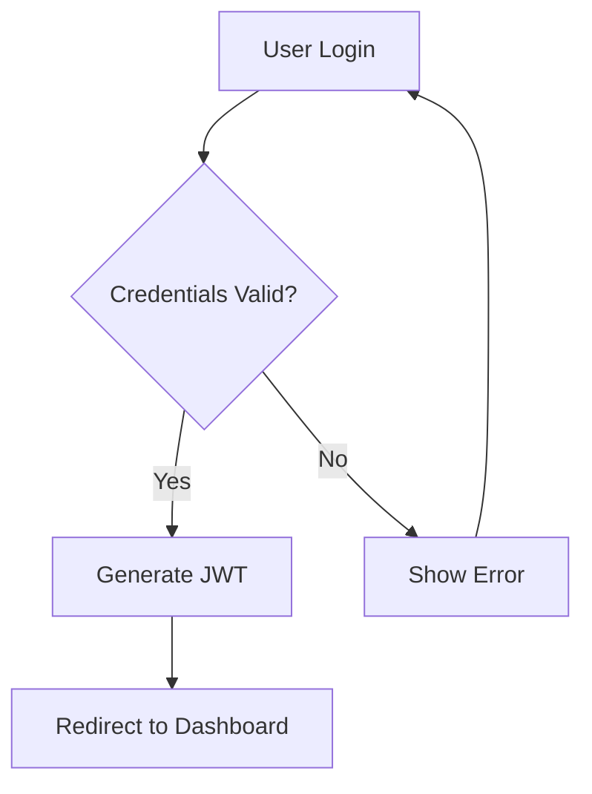
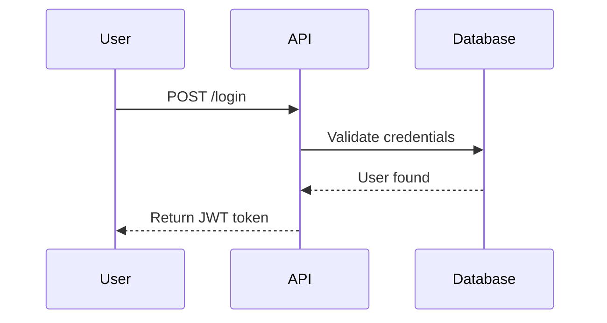

# Mermaid MCP Server

[](https://opensource.org/licenses/MIT)
[](https://nodejs.org/)
[](https://www.typescriptlang.org/)

A **Model Context Protocol (MCP) server** for Mermaid diagram generation, designed to work seamlessly with **GitHub Copilot** and other AI assistants. Generate professional diagrams directly from natural language or code with 22+ diagram types and advanced layout engines.

## 🎯 Features

### ✨ **Core Capabilities**
- **22+ Diagram Types**: Flowcharts, sequence diagrams, class diagrams, ER diagrams, Gantt charts, mindmaps, timelines, and more
- **Advanced Layout Engines**: ELK, Dagre, and Tidy Tree for optimal diagram layouts
- **Smart Validation**: Real-time syntax validation with helpful error messages and suggestions
- **Template System**: 50+ pre-built templates for common use cases
- **Local Processing**: All generation happens locally - no remote calls required
- **SVG Output**: High-quality scalable vector graphics with metadata

### 🔧 **MCP Tools Available**
1. **`generateDiagram`** - Generate and render diagrams to SVG files
2. **`validateDiagram`** - Validate syntax with detailed error reporting
3. **`getDiagramInfo`** - Analyze diagram complexity and metadata
4. **`listSupportedTypes`** - Show all 22+ supported diagram types
5. **`convertDiagram`** - Convert diagrams to different formats
6. **`listTemplates`** - Browse 50+ pre-built templates
7. **`getTemplate`** - Get specific template code and metadata
8. **`searchTemplates`** - Search templates by keyword
9. **`createCustomTemplate`** - Create reusable custom templates

### 🎨 **Supported Diagram Types**
- **Flowcharts** - Process flows and decision trees
- **Sequence Diagrams** - API calls and user interactions
- **Class Diagrams** - Software architecture and relationships
- **State Diagrams** - State machines and workflows
- **ER Diagrams** - Database relationships
- **Gantt Charts** - Project timelines
- **Git Graphs** - Version control workflows
- **Mindmaps** - Brainstorming and organization
- **Timelines** - Historical events and milestones
- **And 13+ more types!**

## 🚀 Quick Start

### Prerequisites
- **Node.js 18+** 
- **npm** or **yarn**
- **GitHub Copilot** (for AI integration)

### Installation

```bash
# Clone or download the project
cd mermaid-mcp-server

# Install dependencies
npm install

# Build the project
npm run build

# Test the server
npm start
```

### GitHub Copilot Integration

Add this to your MCP settings file (usually `~/.config/mcp/settings.json`):

```json
{
  "mcpServers": {
    "mermaid": {
      "command": "node",
      "args": ["/path/to/mermaid-mcp-server/dist/index.js"],
      "env": {}
    }
  }
}
```

## 📖 Usage Examples

### Basic Diagram Generation

```javascript
// Generate a simple flowchart
{
  "tool": "generateDiagram",
  "arguments": {
    "code": "flowchart TD\\n    A[Start] --> B{Decision}\\n    B -->|Yes| C[Process]\\n    B -->|No| D[End]\\n    C --> D",
    "filename": "my-flowchart.svg"
  }
}
```

### Using Templates

```javascript
// Get a pre-built template
{
  "tool": "getTemplate",
  "arguments": {
    "templateId": "sequence-api"
  }
}

// Search for templates
{
  "tool": "searchTemplates",
  "arguments": {
    "query": "authentication"
  }
}
```

### Advanced Configuration

```javascript
// Generate with custom theme and layout
{
  "tool": "generateDiagram",
  "arguments": {
    "code": "sequenceDiagram\\n    participant A\\n    participant B\\n    A->>B: Hello",
    "options": {
      "config": {
        "theme": "dark",
        "securityLevel": "strict"
      },
      "layout": {
        "engine": "elk",
        "direction": "TB"
      }
    }
  }
}
```

## 🛠️ Development

### Project Structure

```
mermaid-mcp-server/
├── src/
│   ├── index.ts          # Main MCP server
│   ├── tools/            # MCP tool implementations
│   │   ├── core.ts       # Core diagram tools
│   │   └── templates.ts  # Template system
│   ├── utils/            # Utilities
│   │   ├── mermaid.ts    # Mermaid integration
│   │   └── filesystem.ts # File operations
│   └── types/            # TypeScript definitions
├── dist/                 # Compiled JavaScript
├── package.json
├── tsconfig.json
└── README.md
```

### Available Scripts

```bash
# Development
npm run dev          # Start in watch mode
npm run build        # Compile TypeScript
npm run start        # Run compiled server

# Quality
npm run lint         # Check code style
npm run lint:fix     # Fix code style issues
npm test             # Run tests (coming soon)
```

### Building from Source

```bash
# Install dependencies
npm install

# Build TypeScript
npm run build

# The compiled server will be in dist/index.js
```

## 🎯 GitHub Copilot Integration

This MCP server is designed to work seamlessly with GitHub Copilot:

### Natural Language → Diagrams
- **"Create a user authentication flow diagram"** → Sequence diagram
- **"Show me a database schema for an e-commerce app"** → ER diagram  
- **"Generate a project timeline for Q1"** → Gantt chart
- **"Make a flowchart for the login process"** → Flowchart

### Code → Visual Documentation
- Automatically generate diagrams from code descriptions
- Convert API documentation to sequence diagrams
- Create architecture diagrams from system descriptions
- Transform requirements into visual workflows

## 📊 Examples Gallery

### Flowchart Example


### Sequence Diagram Example


### Class Diagram Example
```mermaid
classDiagram
    class User {
        +String name
        +String email
        +login()
        +logout()
    }
    
    class Order {
        +int id
        +Date createdAt
        +calculateTotal()
    }
    
    User ||--o{ Order : places
```

## 🌟 Advanced Features

### Layout Engines
- **ELK**: Eclipse Layout Kernel for complex hierarchical layouts
- **Dagre**: Directed graph layout with customizable spacing
- **Tidy Tree**: Clean tree layouts for organizational charts

### Theme Support
- **Default**: Clean professional look
- **Dark**: Dark mode compatible
- **Forest**: Green nature theme
- **Neutral**: Minimal grayscale
- **Base**: High contrast accessibility

### Security Features
- **Strict Mode**: Sanitized input processing
- **Sandbox Execution**: Isolated diagram generation
- **Input Validation**: Comprehensive syntax checking
- **Error Handling**: Graceful failure recovery

## 📋 Template Categories

### Business Process
- User authentication flows
- Order processing workflows
- Customer journey maps
- Business decision trees

### Software Architecture
- API interaction patterns
- Database relationships
- System component diagrams
- Microservice architectures

### Project Management
- Project timelines
- Resource allocation
- Milestone tracking
- Team organization

### Development Workflows
- Git branching strategies
- CI/CD pipelines
- Code review processes
- Deployment workflows

## 🤝 Contributing

We welcome contributions! Here's how to get started:

1. **Fork the repository**
2. **Create a feature branch**: `git checkout -b feature/amazing-feature`
3. **Make your changes** and add tests
4. **Run quality checks**: `npm run lint && npm test`
5. **Commit changes**: `git commit -m 'Add amazing feature'`
6. **Push to branch**: `git push origin feature/amazing-feature`
7. **Open a Pull Request**

### Development Guidelines
- Follow TypeScript best practices
- Add JSDoc comments for new functions
- Include error handling for all operations
- Test with multiple diagram types
- Update documentation for new features

## 📝 License

This project is licensed under the **MIT License** - see the [LICENSE](LICENSE) file for details.

## 🙏 Acknowledgments

This MCP server is built on top of the excellent [Mermaid](https://mermaid.js.org/) diagramming library created by Knut Sveidqvist and contributors.

- **Mermaid**: https://github.com/mermaid-js/mermaid (MIT License)
- **Mermaid Live Editor**: https://github.com/mermaid-js/mermaid-live-editor (MIT License)
- **Model Context Protocol**: https://github.com/modelcontextprotocol/

## 🔗 Links

- **Mermaid Documentation**: https://mermaid.js.org/
- **MCP Specification**: https://spec.modelcontextprotocol.io/
- **GitHub Copilot**: https://github.com/features/copilot
- **Issue Tracker**: https://github.com/yourusername/mermaid-mcp-server/issues

---

**Made with ❤️ for the developer community**

*Generate beautiful diagrams effortlessly with AI assistance!* 🎨✨